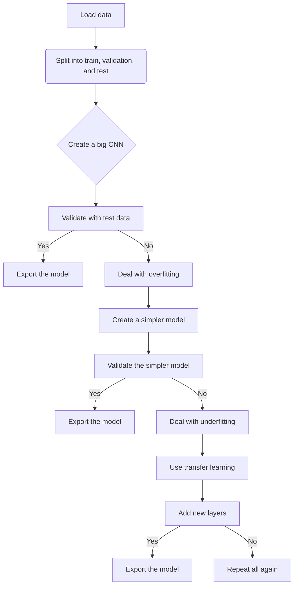

# Convolutional Neural Network based on ResNet152-V2 to predict COVID-19 disease

This repository contains the Convolutional Neural Network (CNN) model created to predict the COVID-19 disease based only in the x-ray chest scans.

**Table of Contents**

* **covid-19-transfer-learning-resnet152v2.ipynb** is the jupyter notebook with the data treatment, model creation and model validation.

### Data 

----
- The data comes from the following Kaggle repository : https://www.kaggle.com/datasets/pranavraikokte/covid19-image-dataset/code?datasetId=627146&sortBy=dateRun&tab=profile
- The data has two folders training and test. The training folder was split into 80% for training and 20% for validation. 

### Model results
---

The best model was the one who used transfer learning with a ResNet152-V2 architecture. The model was able to get 0.65 of loss and 0.92 of accuracy. 
                
### FlowChart of the Model Construction
---

### Contacts:
---
- [Twitter](https://twitter.com/sarasti_seb)
- [LinkedIn](https://linkedin.com/in/sebastiansarasti)
- [ResearchGate](https://www.researchgate.net/profile/Sebastian-Sarasti-2)

